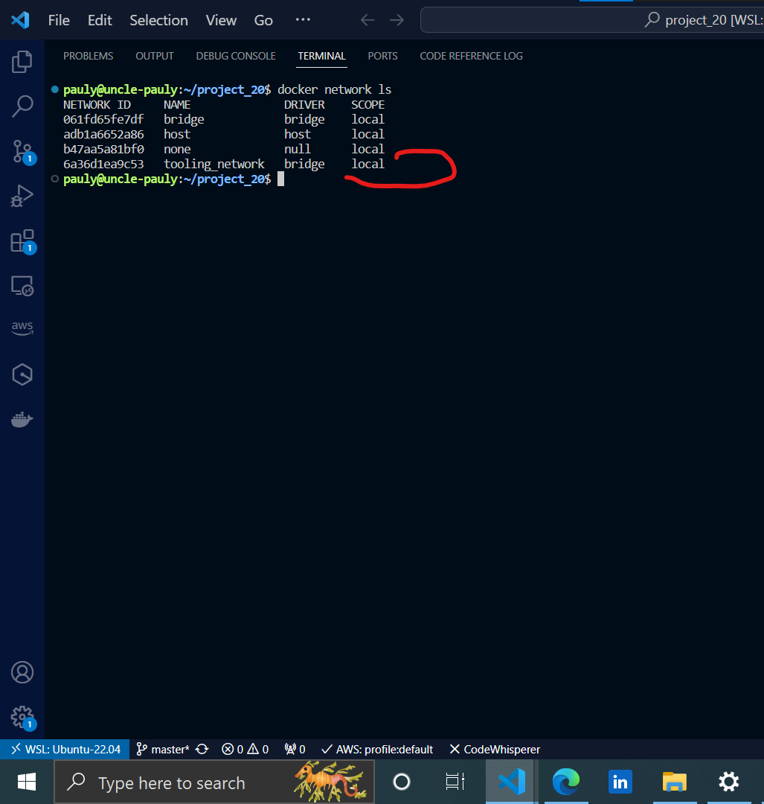
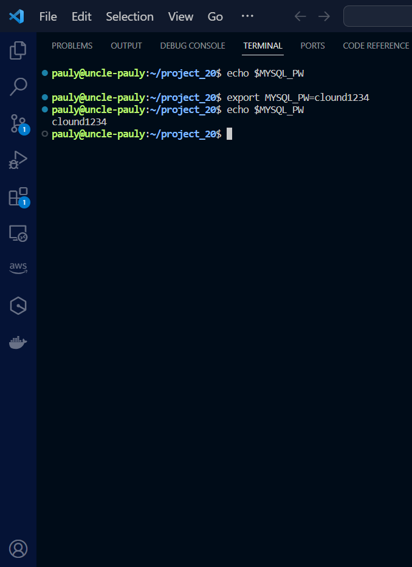

# MIGRATION TO THE СLOUD WITH CONTAINERIZATION. PART 1 – DOCKER & DOCKER COMPOSE

Never forget that the goal of DevOps is to make the software delivery process efficient, we've seen how we can use accomplish this using IAC i.e terraform, we are going to use another tool today that is widely used by DevOps engineers to improve the efficiency of software delivery, DOCKER.

Later on we will add a CI tool i.e jenkins to achieve a multi-branch pipeline

  We will be deploying the tooling app packed with it's MySql backend using containers.

### MySql in a container
 We start be assembling the database layer of the tooling application. Pull a MySql container, configure it, and make sure it
is ready to receive requests from our PHP application.

#### First create a network 
```
$docker network create --subnet=10.0.1.0/24 tooling_network

$docker network ls
```


#### Create an environment variable to run the root password of the msql
```
$export MYSQL_PW= *****

$echo $ export MYSQL_PW
```


#### Pull and run the container
```
$ docker run --network tooling_network -h mysqlhostserver --name=mysql-server -e MYSQL_ROOT_PASSWORD=${MYSQL_PW} -d mysql/mysql-server:latest

$docker ps -a
```


#### Connecting to the MySQL server
It is not encouraged to connect to the MySQL server remotely using the root user, there are security risks to doing this. The workaround this is to use a SQL script to create a user we can use to connect to the server remotely.

- create a file named `create_user.sql` and add the code below to it:
```
 CREATE USER 'pauly'@'%' IDENTIFIED BY 'pauly1234'; 
 GRANT ALL PRIVILEGES ON * . * TO 'pauly'@'%';
```


- Run the script, ensure you are in the directory where the script is located
```
docker exec -i mysql_server mysql -uroot -p${MYSQL_PW} < create_user.sql
```


If you see a warning like below, it is acceptable to ignore:


#### Connect to the MySQL server from a client
We will connect to the MySQL server from a second container running the MySQL client. Using this approach we don't have to install any client tool on our local laptop and there's no need to connect directly to the container running the MySQL server

- Run the MySQL client container:
```
 docker run --network tooling_network --name mysql-client -it --rm mysql mysql -h mysqlhostserver -u pauly  -p 
```


#### Prepare Database Schema

Next we prepare a database schema so the tooling app can connect to it, we already hava a script that creates the database and prepares the database schema in repo containing the toolins app source code.

- Clone the tooling app repo:

```
git clone git@github.com:NyerhovwoOnitcha/tooling.git
```

- Export the location of the SQL file as an env 

```
export tooling_db_schema=/home/pauly/project_20/tooling/html/tooling_db_schema.sql
echo $tooling_db_schema
```

- Use the SQL script to create the database and prepare the schema. With the docker exec command, you can execute a command in a running container.

```
 docker exec -i mysql-server mysql -uroot -p${MYSQL_PW} < $tooling_db_schema 
```

-  Update the .env file with connection details to the database The .env file is located in the html tooling/html/.env folder

```
sudo vi .env

MYSQL_IP=mysqlserverhost
MYSQL_USER=username
MYSQL_PASS=client-secrete-password
MYSQL_DBNAME=toolingdb 

WHERE:
- MYSQL_IP mysql ip address "leave as mysqlserverhost"
- MYSQL_USER mysql username for user export as environment variable
- MYSQL_PASS mysql password for the user exported as environment varaible
- MYSQL_DBNAME mysql databse name "toolingdb"

```

### Run the Tooling app.
- Create the dockerfile, run the build command, and launch the container.

- Build the tooling image
```
docker build -t tooling:1.0.0 .
```


- Run the container

```
docker run --network tooling_network -p 8085:80 -it
tooling:1.0.0
```


<!-- - Pull the container:

    `docker pull mysql/mysql-server:latest`

- Run the Container:

 `docker run --name <container_name> -e MYSQL_ROOT_PASSWORD=<my-secret-pw> -d mysql/mysql-server:latest`

- Connect to the container, this can be in 2 ways:

 `docker exec -it mysql bash` or `docker exec -it mysql mysql -uroot -p`

- exec used to execute a command from bash itself
- it makes the execution interactive and allocate a pseudo-TTY
- bash this is a unix shell and its used as an entry-point to interact with our container
- mysql The second mysql in the command "docker exec -it mysql mysql 
- uroot -p" serves as the entry point to interact with mysql container just like bash or sh
-u mysql username
-p mysql password


Remember that unlike vms' containers are not meant to host ans OS, they are meant to run a specific task or process, once the task is complete the containers exit thus, **the container inly lives as long as the process inside it is alive** -->